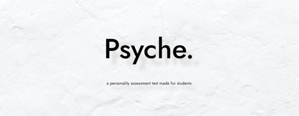

# Psyche

### About The Project
Group project built during year 2.  
Psyche is a personality assessment website designed for students. 
I developed the frontend of this project.
> *this repository only showcases the codes/parts done by me*
### Built with
- HTML
- CSS
- JS
- [aos-master(royalty free JS animation library)](https://michalsnik.github.io/aos/)
- Photoshop (for editing illustrations)
- [royalty free illustrations](https://www.freepik.com/author/macrovector)
### Demo
[demo website](https://psychedemodemo.000webhostapp.com/)
> free website hosting (some photos have error loading from time2time)
### Screenshots
 home page:  

 assessment page: 

 personality types page: 

 counselling page: 

 about page: 

 result page: 

 details page: 

